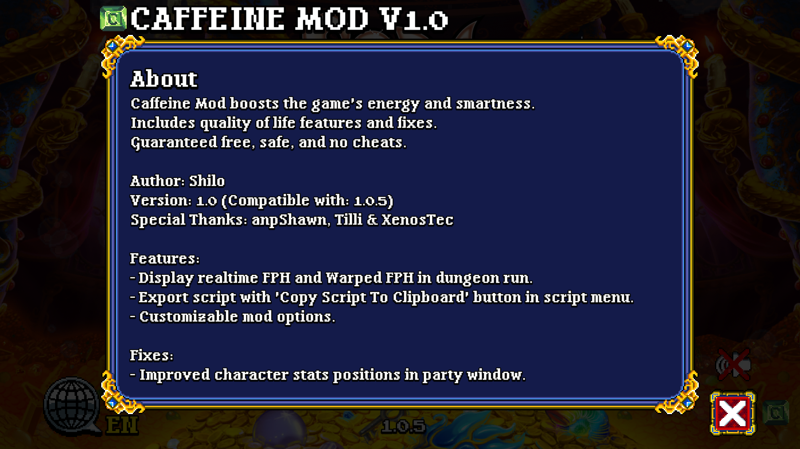

# SD2 Caffeine Mod
  
[Caffeine](https://github.com/Shilo/SD2-Caffeine-Mod/releases)  
> Author: Shilo  

Caffeine Mod boosts Soda Dungeon 2's energy and smartness.  
Includes quality of life features and fixes.  
Guaranteed free, safe, and no cheats.  

## Disclaimer:
All code and rights belong to their respective owners: AN Productions, Poxpower, Armor Games Studios or other.  
I take no credit for any of the original code and assets.  
Use this mods at your own risk: I am not responsible for any results of using this mod.  
The terms "safe" and "cheats" are subjective.   
By using this mod, you agree to the above terms.

## Download
[Latest version](https://github.com/Shilo/SD2-Caffeine-Mod/releases)

## Compatibility Warning
Only install this mod with the compatible SD2 version specified (for example, Caffeine Mod v1.0 only supports SD2 v1.0.5). If you install the mod with an incompatible SD2 version, unwanted results will happen. The game will most likely freeze or crash. The game may also downgrade to an older SD2 version. If you happen to run into this issue, you can [uninstall the mod](https://github.com/Shilo/SD2-Caffeine-Mod/blob/master/README.md#uninstallation) to revert back to the original working game. Or you can repair your game via Steam's ["Verify Integrity of Game Files..."](https://support.steampowered.com/kb_article.php?ref=2037-QEUH-3335) button.

## Installation
> Note: If the game is updated, the mod will be automatically uninstalled.
- Download the [mod here](https://github.com/Shilo/SD2-Caffeine-Mod/releases).
- Unzip downloaded folder.
- Install with one of two methods:
### 1. Mod Auto Install
- Coming soon...
- If game is running, exit and restart it.
### 2. Manual
- Navigate to folder: `C:\Program Files (x86)\Steam\steamapps\common\Soda Dungeon 2\SodaDungeon2_Data\Managed\`
- Create a copy/backup of `Assembly-CSharp.dll` (preferably in the same folder).
- Replace `Assembly-CSharp.dll` with the exact file that was downloaded.
- If game is running, exit and restart it.

## Uninstallation
> Note: If the game is updated, the mod will be automatically uninstalled.
- Uninstall with one of three methods:
### 1. Mod Auto Uninstall
- Coming soon...
- If game is running, exit and restart it.
### 2. Steam's "Verify Integrity of Game Files..."
- Repair your game via Steam's ["Verify Integrity of Game Files..."](https://support.steampowered.com/kb_article.php?ref=2037-QEUH-3335) button.
- If game is running, exit and restart it.
### 3. Manual
- Locate file: `C:\Program Files (x86)\Steam\steamapps\common\Soda Dungeon 2\SodaDungeon2_Data\Managed\Assembly-CSharp.dll`
- Replace file with a backup/original version. There should be a backup in the same folder if you followed the installation correctly.
- If game is running, exit and restart it.

## Changes

### Features
- Display realtime FPH and Warped FPH in dungeon run.
- Export script with 'Copy Script To Clipboard' button in script menu.
- Customizable mod options.

### Fixes
- Improved character stats positions in party window.

## Special Thanks
- [anpShawn](https://www.sodadungeon.com/)
- [Tilli](https://discord.gg/y93QchM)
- [XenosTec](https://discord.gg/y93QchM)
